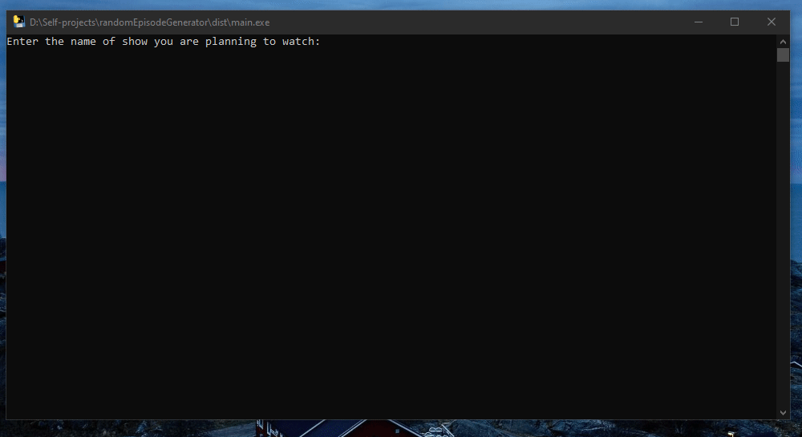

## Random Episode generator



### Ideation
Once we are done watching a TV show, many times we just wanna pick a random episode to rewatch,
and relive the experience. In some countries, for a TV show names ***Friends***, Netflix has given
such a button to pick an episode, but that is missing in Netflix India as of Aug'20. Also, we need such
a picker for any of the show we want to use in rejuvenetion of our experience. So this project.

### What to do
* Linux Users
```
git clone https://github.com/rs9899/randomEpisodeGenerator.git
cd randomEpisodeGenerator
pip install -r requirements.txt
python main.py
```

* Windows Users : Yes, this time I have tried taking care of windows user too as more than often they miss out
on many of the github projects.

Method 1 (Suggested)
* [Download Visual Studio C++](https://www.microsoft.com/en-in/download/details.aspx?id=48145)
* Download the executable by [clicking here](https://github.com/rs9899/randomEpisodeGenerator/raw/master/Final%20Executables/main.exe)
* Run the executable

Method 2
* Download [Python for Windows](https://www.python.org/downloads/windows/)
* Follow the steps as per Linux users

### Future plans
* Make this executable for user interactive.
* Fetch the streaming service where the content can be viewed with a URL link to do the same.
* In case of people having episodes downloaded offline, do a tree traversal and pick the episode.

### Thanks for checking this out
Also check other random experiments on [my website](https://rupesh.info) & [my github page](https://github.com/rs9899/)
